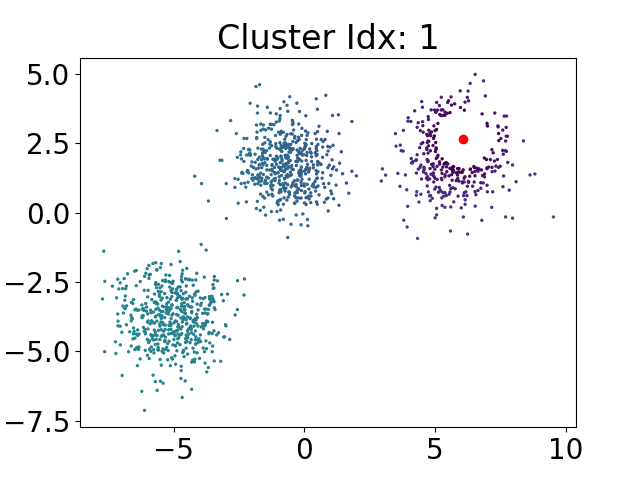
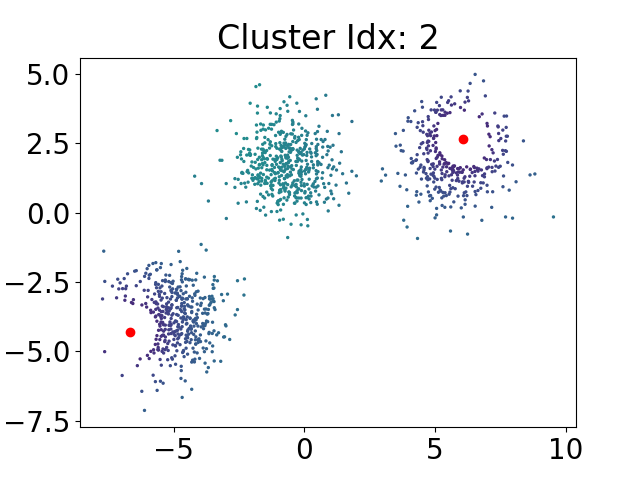
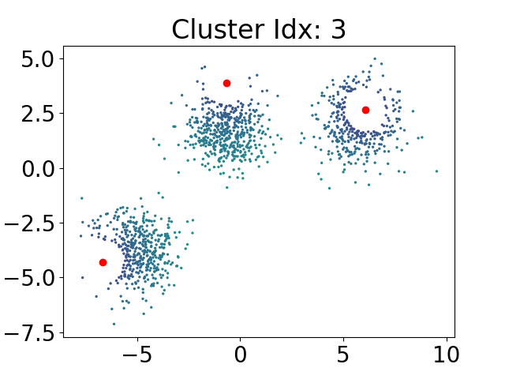

# DP-Means++

### Authors: Rylan Schaeffer, Ila Rani Fiete

-----

## Status: Abandoned

DP-Means++ failed to show any improvement over DP-Means. DP-Mean's method of
initializing clusters captures the benefits of K-Means++ because of two interacting reasons.

1. Recall that in K-Means++, we sequentially choose our centroids by sampling data proportional 
  to each datum's squared distances to the nearest centroid, to incentivize centroids to be far 
  away from one another. DP-Mean's method of initializing centroids says that if a point is within
  the maximum allowable distance to its nearest existing centroid, it can't be used to create a
  new centroid; the consequence is that centroids are also spaced away from one another. 
2. If we had a limited budget of clusters (e.g. K=3), then the K-Means++ prioritization of far
  distance points makes it more likely that our initial centroids better cover the space. But 
  DP-Means says to keep adding centroids until all points are within the max allowable distance. 
  Consequently, DP-Means will necessarily cover the entire space.

Hopefully the following sequence of plots will make this feel more intuitive. In both DP-Means and DP-Means++, 
we might sample the following point below in red as our first centroid. I then plot the remaining
data colored by the probability of being selected as the next centroid; the white circle around
the red dot is telling us that we can't select any of those points.

Randomly, we select the lower left red point as our 2nd centroid.

Next, we select our 3rd centroid.

If we were doing K-Means, and K=3, we'd have a very good initialization of centroids.
However, DP-Means would continue adding centroids because not every point is sufficiently 
close to a centroid, so we must keep adding more centroids! So both DP-Means and DP-Means++
will continue adding centroids until every point is close to a centroid. The end result is 
that the clusters then tile (bubble?) the space. Whether we add centroids by sampling uniformly
at random from points outside bubbles or by sampling proportional to distance from the nearest 
bubble appears to make little difference.

## Setup

After cloning the repository, create a virtual environment for Python 3:

`python3 -m venv dpmeanspp_venv`

Then activate the virtual environment:

`source dpmeanspp_venv/bin/activate`

Ensure pip is up to date:

`pip install --upgrade pip`

Then install the required packages:

`pip install -r requirements.txt`

We did not test Python2, but Python2 may work.

## Running

Each experiment has its own directory, each containing a `main.py` that creates a `plots`
subdirectory (e.g. `exp_00_ibp_prior/plots`) and then reproduces the plots in the paper. Each 
`main.py` should be run from the repository directory e.g.:

`python3 exp_00_ibp_prior/main.py`

## TODO

## Contact

Questions? Comments? Interested in collaborating? Open an issue or 
email Rylan Schaeffer (rylanschaeffer@gmail.com) and cc Ila Fiete (fiete@mit.edu).
